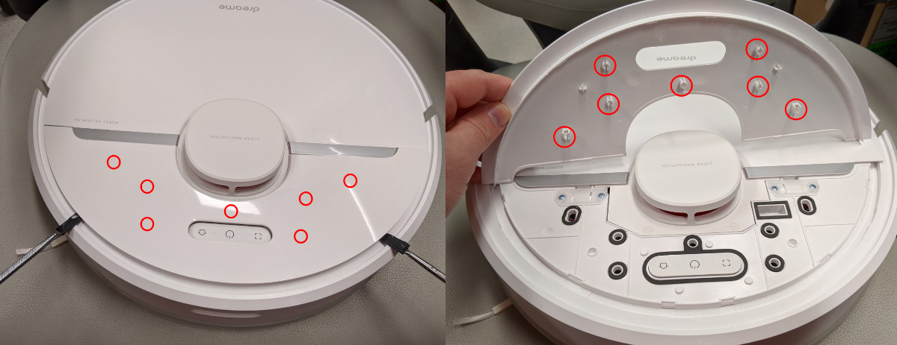
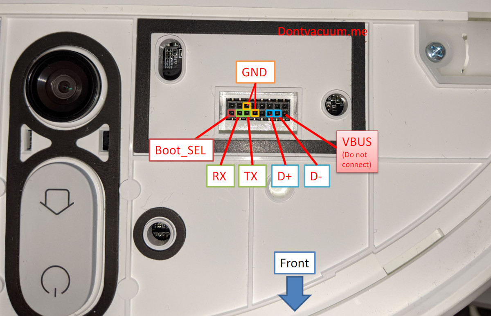

# Rooting instructions

This page contains an incomplete overview of installation instructions for various robots

## Dreame

Dreame rooting is currently possible for

* Dreame L10 Pro
* Dreame Z10 Pro
* Dreame F9
* Dreame D9
* Xiaomi Vacuum Robot 1C
* Xiaomi Vacuum Robot 1T

It has been released with Dennis Giese's DEF CON 29 Talk [Robots with lasers and cameras but no security Liberating your vacuum](https://youtu.be/EWqFxQpRbv8?t=1525).
For more information, head over to the [Dustbuilder](https://builder.dontvacuum.me/).

It is also recommended to join the [Dreame Robot Vacuum Telegram Usergroup](https://t.me/joinchat/VwEy4UeBrf45MTZi) for rooting support etc.

### Reset-Button UART

**Dreame is aware of this and might patch it in newer firmwares. Therefore, don't update your robot in the Mi Home App**

There are other ways to root as well, however this one is very easy and very reliable so use that if you can.
What we're doing is basically just injecting a custom OTA update including hooks for valetudo, and sshd etc.

To do this, you'll only need a 3.3V USB to TTL Serial UART Adapter (like CP2102 or Pl2303) and dupont cables. Basic linux knowledge and a pry tool will help as well.



To open the robot, gently pry up with a pry tool or your fingers on the smaller half with the buttons. Taking this plastic off is probably the hardest step.

Once you have the cover off, you need to connect your USB to Serial UART adapter to the robot. Make sure your adapter is set to 3.3V if if has the option to change to something else. You only need 3 wires for this connection (GND, RX, and TX). Connect GND on the adapter to any of ground ports on the robot first and then connect RX on the adapter to TX on the robot and TX on the adapter to RX on the robot. Lastly, plug the adapter into your laptop.




Now you have to open a serial connection from your laptop to the device, this can be done with putty, miniterm, minicom or through a tool like screen with the following command: `screen /dev/ttyUSB0 115200,ixoff`. The baud rate is 115200 and flow control (XIN, XOUT) needs to be off.

Once your connection is ready, turn on the vacuum by pressing and holding the middle button (POWER) for at least 3 seconds. 

You should see some logs and one of the last ones will say root password changed. If your logs are going crazy, one of your wires are probably loose or doesn't have a good connection.

To use the Wifi Reset method, open up the other side of the robot and press the reset button shortly (<1 second) with a pen or paperclip. Your UART connection should pop up with the login prompt like `"p2029_release login”`

When connected, you can log in as `root` and then it will ask for a passwrod.
To calculate the password use the full serial number of your robot, which can be found on the sticker below the dustbin.
**Not the one on the bottom of the robot nor the one on the packaging. You'll have to take out the dustbin and look below it into the now empty space.**

To get the password, use the following [Calculator](https://gchq.github.io/CyberChef/#recipe=Find_/_Replace(%7B'option':'Regex','string':'(%5C%5Cn%7C%5C%5Cr)'%7D,'',true,false,true,false)MD5()Find_/_Replace(%7B'option':'Regex','string':'$'%7D,'%20%20-%5C%5Cn',false,false,false,false)To_Base64('A-Za-z0-9%2B/%3D')&input=UDIwMDkwMDAwRVUwMDAwMFpN) or enter the full SN (all uppercase) into this command on Linux
`echo -n "P20290000US00000ZM" | md5sum | base64` or the following commands on Mac 
````
echo -n "P20290000US00000ZM" | md5
echo -n -e "MD5HASHONLY"  -\n" | base64
````

Once logged in, build a patched firmware image for manual installation via the [Dustbuilder](https://builder.dontvacuum.me). You’ll need to put in your email, serial number and SSH key if you have one. Make sure you settings match these

✅Patch DNS (requirement for valetudo deployment, disables real cloud!!)

✅Preinstall Nano texteditor, curl, wget, htop, hexdump 

✅Build for manual installation (requires SSH to install)

Then accept at the bottom and `Create Job`. This will send your build to your email once it’s built. Download the `tar.gz` file to your laptop.

To get this file over to the robot, you'll need to spin up a temporary webserver (e.g. by using `python3 -m http.server`) in the directory where you downloaded your firmware image to,
connect the laptop to the robots WiFi access point and download the firmware image to the robot via e.g. `wget http://<your-laptop-ip>/dreame.vacuum.pxxxx_fw.tar.gz`.
If you're running Home Assistant OS (with Supervisor), you might find it easier to put the file in your `/config/www/` folder via Samba Share and then grab the file over http from there.
For Home Assistant method, you need to replace `<your-laptop-ip>` with `<your-ha-ip-address>:8123/local/`

Then, untar `tar -xvzf dreame.vacuum.pxxxx_fw.tar.gz` it and execute the `./install.sh` script. The robot will then reboot and greet you with a shell mentioning the Dustbuilder in the MOTD.

Switch to the tmp folder `cd /tmp` and repeat the previous steps (from wget to install.sh) to also install the firmware on the second partition which you are now booted to.

````
cd /tmp 
wget http://<your-laptop-ip>/dreame.vacuum.pxxxx_fw.tar.gz
tar -xzvf dreame.vacuum.pxxxx_fw.tar.gz
./install.sh
````

The robot will reboot automatically after it has installed the update. Make sure that it is docked during this procedure
as otherwise the update might fail.

To select the correct Valetudo binary for your robot, refer to this list:

* valetudo (1C, F9, Z500)
* valetudo-lowmem (D9)
* valetudo-aarch64 (everything else, Dreame Z10 Pro requires version 2021.08.1 or later)


After that, check out the `/misc/how_to_modify.txt`, copy the `_root_postboot.sh.tpl` to `/data` (`cp /misc/_root_postboot.sh.tpl /data/_root_postboot.sh`), make it executable (`chmod +x /data/_root_postboot.sh`),
put a matching Valetudo binary for your robot in `/data` (same webserver wget thing as above), call it `valetudo` and make that executable (`chmod +x valetudo`).

````
wget http://<your-laptop-ip>/valetudo-aarch64 --no-check-certificate -O /data/valetudo
chmod +x /data/valetudo
cp /misc/_root_postboot.sh.tpl /data/_root_postboot.sh
reboot
````

Reboot, connect to the robots WiFi AP again, open up a browser, point it to `http://192.168.5.1` and then set up Wi-Fi via Valetudo.
Don't be confused by the UI not loading the state. The robot needs to be provisioned (connected to a WiFi) for that to work.

You now have a rooted Dreame vacuum robot running Valetudo.

It is recommended to now back up your calibration and identity data. One way of doing that is by creating a tar
like so: `cd / ; tar cvf /tmp/backup.tar /mnt/private/ /mnt/misc/` and then using `scp root@<robot-ip>:/tmp/backup.tar .` to copy it to a safe location that isn't the robot. Another way is to just copy and paste the output of the following commands in CLI into a text file.
````
grep "" /mnt/private/ULI/factory/* 
grep "" /mnt/misc/*.json 
grep "" /mnt/misc/*.yaml 
cat /mnt/misc/*.txt 
hexdump /mnt/misc/*.bin
````

## Roborock

For more information, simply click on the link if there is one.
Overall, things got harder as time went by.

### OTA

The ***O**ver-**t**he-**A**ir[-Update]* rooting method is the easiest one requiring no disassembly nor attaching any cables. However, since Xiaomi disabled local OTA in newer versions of the `miio_client` (> 3.3.9), you might need to downgrade your firmware by factory resetting your robot.

Unfortunately, robots made after 2020-03 come with a non-local-OTA capable recovery firmware version so for those robots
you will need to follow the instructions below.

This works by using the official OTA update mechanism to push a customized (rooted + valetudo) firmware image to the robot.
It will happily accept that, because they aren't signed. For more information, check out the talk
[Unleash your smart-home devices: Vacuum Cleaning Robot Hacking](https://media.ccc.de/v/34c3-9147-unleash_your_smart-home_devices_vacuum_cleaning_robot_hacking). 


The procedure is documented here: [https://valetudo.cloud/pages/installation/roborock-ota.html](https://valetudo.cloud/pages/installation/roborock-ota.html)

This method applies to the following robots:
* Roborock V1 pre 2020-03
* Roborock S5

### Vinda

The vinda file method unfortunately requires full disassembly of the robot as well as soldering some wires which will
void your warranty.

In short, there's a file called `vinda` which contains the root password XOR'd with `0x37`.
By dropping into the u-boot shell, you can use the `ext4load` u-boot command usually used for loading a kernel to load
that file into memory and therefore read out the root password.

Then, you simply use an interactive shell via UART to achieve persistence.

Dennis made two videos explaining both disassembly as well as the actual root procedure.
They can be found here: [https://www.youtube.com/playlist?list=PL9PoaNtZCJRZc61c792VCr_I6jQK_IdSb](https://www.youtube.com/playlist?list=PL9PoaNtZCJRZc61c792VCr_I6jQK_IdSb)

This method applies to the following robots:
* Roborock V1 post 2020-03
* Roborock S6 pre 2020-06 (?)
* Roborock S4

Don't be confused by the Video not mentioning your particular robot model.
It's the same procedure for all robots listed here.

Also, your robot might come with a newer firmware which doesn't feature a `vinda` file.
In that case, you'll need to follow the instructions below.

### Init override

Since there's no `vinda` file on these robots/firmwares, the approach here is to drop into the u-boot shell and edit the
kernel commandline so that `init` becomes `/bin/sh` which also gives you a rootshell, but requires you to quickly do some
initializing, because otherwise the hardware watchdog will reboot the robot.

Furthermore, due to limited storage, the new firmware is actually streamed onto the device.

The disassembly process plus the testpoints used are the same as the vinda method above so make sure to watch those videos
before attempting this.

The procedure is documented here: [https://builder.dontvacuum.me/s5e-cheatsheet.txt](https://builder.dontvacuum.me/s5e-cheatsheet.txt)

This method applies to the following robots:
* Roborock S6 post 2020-06 (?)
* Roborock S5 Max
* Roborock S6 Pure
* Roborock S4 Max

## Viomi

3irobotix is the manufacturer of vacuum robots sold under various brand names including
- Viomi 
- Cecotec
- Prosenic
- Kyvol
- Neabot

For now, only one vacuum robot is supported (WIP):
* Mijia STYJ02YM **viomi.vacuum.v7**

To install Valetudo on your Viomi V7, follow the instructions found [here](https://valetudo.cloud/pages/installation/viomi.html).

We're currently looking into the possibility of reflashing other brands to Viomi so that they work with Valetudo without
any additional code.
